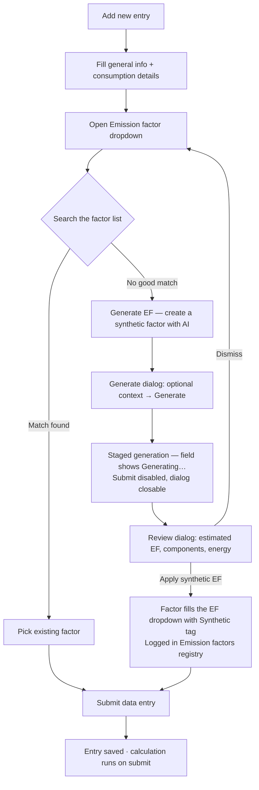
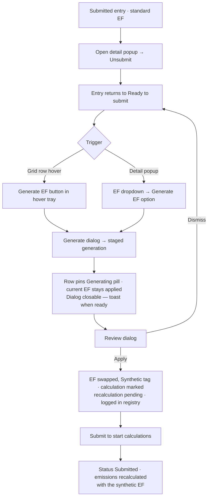
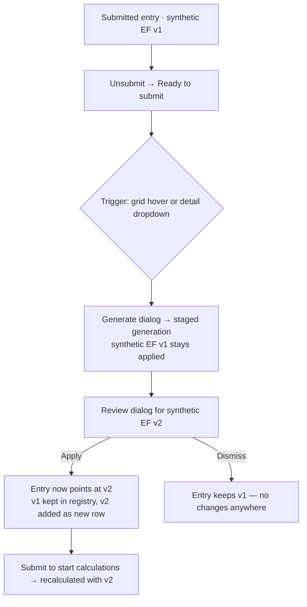

# Synthetic EF — user flows and logic (SCCF data entries)

Status: draft for review · Owner: Dan Wu · Last updated: 2026-07-10
Prototype: https://onedatatablebuild.vercel.app/data-entries-improve-ef.html

This document defines the logic for generating a synthetic emission factor (EF) on a data entry, across the three starting conditions. It matches the interactive prototype unless marked **[open]** or **[prototype gap]**.

---

## Shared foundations (apply to all three scenarios)

**One dialog component, every entry point.** Generate EF always runs the same sequence:

```
Generate EF (trigger) → Generate dialog (optional context) → staged generation
→ Review dialog (components, energy, estimated EF) → Apply / Dismiss
```

**Core rules**

1. **Non-destructive to the entry until Apply.** The currently assigned EF stays applied to the entry through generation and review. The entry's factor does not change until the user clicks *Apply synthetic EF*.
2. **The factor is saved at generation, not at Apply.** The synthetic EF is written to Manage → Emission factors (source: *Synthetic EF*) the moment generation completes, whether or not the user goes on to apply it. Apply only points the row at the already-saved factor; Dismiss leaves it in the registry unused. (PM alignment, 2026-07-10.)
3. **Generation is backgroundable.** The dialog can be closed mid-generation; the row shows a pinned *Generating* pill, then a pinned *Review →* button. A toast announces readiness.
4. **Apply ≠ recalculate.** Applying swaps the factor on the entry. Emissions are recalculated only when the user submits the entry (*Submit to start calculations*).
5. **Synthetic EFs are not primary data.** In the registry a synthetic factor's type is *Secondary* and the *This is primary data* flag is unchecked (it is AI-estimated, not measured).
6. **Dismiss is safe.** Dismissing the proposal from the Review dialog discards the row's link to it; the row returns to its previous state and the current EF (if any) stays applied. The factor remains in the registry (rule 2).
7. **Availability is eligibility-gated (epic DAM-7718).** Generate EF is offered only on **weight-based entries (kg) in scope 3.1/3.2 with a description**, in an editable status: the new-entry form, *Ready to submit*, and *Draft* — in both the grid hover CTA and the detail dropdown. Submitted entries must be unsubmitted first. Ineligible entries (spend-based, other categories, or no description) never see the trigger.
8. **Submit is blocked while a proposal is open.** While an entry has a synthetic EF generating or awaiting review, *Submit to start calculations* is disabled — the user must apply or dismiss the proposal first. Save draft stays available.
9. **Editing weight-driving inputs invalidates a pending proposal.** If the user edits the weight-based inputs (Cat 3.1 / 3.2) while a proposal is generating or awaiting review, applying it fails and an error is shown; editing any other field leaves the proposal applicable. **[edge case — not yet built in the prototype: the detail fields are read-only]**
10. **Generation status is shown per step:** building bill of materials → estimating component weights → estimating energy consumption → matching emission factors. No public-source research step in v1 (context is a single free-text field). Expect roughly 5–10 minutes.
11. **Naming (epic DAM-7718):** registry name = `Synthetic EF – {description}` plus ` N` when multiple factors exist for the same description. The entry cell shows the Synthetic badge next to this name after apply.
12. **Failure state:** a job can fail (no reason surfaced). The row shows a pinned *Failed* pill with **Generate again** and **Dismiss**; the detail popup shows the same in a banner. Nothing is written to the registry on failure; the current EF stays applied. (Prototype demo hook: type "fail" in the context field.)
13. **Concurrency:** up to 5 generation jobs run at once, each row tracking its own state; a 6th attempt is refused with an error message.

**Entry state machine (EF axis, per entry)**

```
idle ──Generate──▶ generating ──done──▶ ready-for-review ──Apply──▶ applied (recalc pending)
                        │                      │                          │
                        └──(closable dialog)   └──Dismiss──▶ idle         └──Submit──▶ submitted (recalculated)
```

---

## Scenario 1 — No assigned EF (manual data entry creation)

**Precondition:** user is creating a data entry manually; no EF is assigned yet.
**Entry point:** the EF dropdown inside the *New data entry* popup (only place — no grid CTA exists for an unsaved entry).



Key behaviours:

- The *Generate EF* and *Create custom emission factor* options sit at the bottom of the dropdown menu in every search state (full list, filtered, no-match).
- While generating, the EF field shows the in-progress state and **Submit is disabled** — the entry cannot be saved with a factor still in flight.
- After Apply, the field remains a dropdown: the user can still swap to a library factor or regenerate before submitting.
- The synthetic EF is written to the registry **at generation** (shared rule 2), so it is reusable even if the entry is discarded or the proposal dismissed.

---

## Scenario 2 — Assigned non-synthetic EF (submitted entry)

**Precondition:** entry is *Submitted* with a standard library/spend-based match.
**Gate:** submitted calculations are locked — the user must **Unsubmit** first.
**Entry points (after unsubmit):** (a) the grid row-hover *Generate EF* button, or (b) the EF dropdown inside the entry detail popup.



Key behaviours:

- Both triggers open the identical dialog; there is no difference downstream.
- Between Apply and Submit, the detail popup shows the new factor in the EF field while the Calculation card keeps the previous factor's values with a *recalculation pending* note — the numbers never silently change before re-submission.
- The previous (standard) factor is not deleted; it remains referenced in the audit log of the entry. The registry gains one new row: `Synthetic <name>` / source *Synthetic EF*.
- **[prototype gap]** Unsubmit in the prototype only toasts; in the product it should flip the entry to *Ready to submit*, which then exposes both triggers.

---

## Scenario 3 — Assigned synthetic EF (submitted entry, regeneration)

**Precondition:** entry is *Submitted* and its factor is already a synthetic EF.
**Gate and entry points:** identical to scenario 2 — Unsubmit, then grid hover button or detail dropdown.



The flow itself is unchanged — same CTA (*Generate EF*), same dialog, same apply/submit split. The design question is what happens to the **previous synthetic EF**.

### Recommendation on the TBD: keep the previous synthetic EF, add the new one as a separate registry entry

**Do not update in place.** Reasons:

1. **Auditability is the product.** A factor that has been used in a submitted calculation must stay immutable, or historical emissions stop being traceable to the factor that produced them (GHG Protocol audit expectations; our provenance principle).
2. **Other entries may reference it.** A synthetic EF can be associated with more than one item; mutating it would silently change other calculations.
3. **Predictability.** "Generating always creates a new factor" is one rule the user can learn. "Sometimes it updates, sometimes it creates" depends on hidden state (has it been used?) that users cannot see.

**Registry hygiene so this does not become clutter:**

- The *Associated items* column already shows usage; a factor left with 0 associated items after a swap is identifiable and can be archived (not deleted) from the registry. **[open — archive interaction TBD]**
- Optional: a *Superseded by* reference between v1 → v2 in the factor detail, so the lineage is one click away.
- Naming: keep the same generated name; disambiguate by *Created on* (and version suffix only if both remain in active use).

**CTA:** keep **Generate EF** everywhere, including regeneration. The user's intent ("get me a better factor") is the same whether the current factor is synthetic or not, and the Review dialog already frames the decision as *Apply* (replace current) vs *Dismiss* (keep current). A distinct "Regenerate" verb would add a second label for the same action without changing anything downstream.

**Alternative considered (not recommended):** update the existing synthetic EF in place when it has never been used in a submitted calculation. Saves registry rows but introduces the conditional behaviour above; revisit only if registry volume becomes a real problem.

---

## State × availability matrix

| Entry status | EF assigned | Grid hover: Generate EF | Detail dropdown: Generate EF | New-entry dropdown |
|---|---|---|---|---|
| New (unsaved) | none | — (no row yet) | — | Yes |
| Draft | pending match | No | No | — |
| Ready to submit | standard EF | Yes | Yes | — |
| Ready to submit | synthetic EF | Yes (regenerate) | Yes (regenerate) | — |
| Submitted | any | No — unsubmit first | No — unsubmit first (footer: Unsubmit) | — |
| Any | generating | Pinned *Generating* pill | *Generating…* banner | Field shows generating |
| Any | ready for review | Pinned *Review →* | *Ready for review* banner + Review | Field shows *Review →* |

## Resolved (board review, 2026-07-10)

- **Registry write timing:** at generation, not Apply (shared rule 2). Consequence: dismissed and abandoned generations still leave a factor in the registry — see archive question below.
- **Synthetic EFs are not primary data:** type *Secondary*, primary-data flag off (rule 5).
- **Review is whole-BOM:** the user reviews all components + energy consumption and applies or dismisses; no per-component review or editing in v1.
- **No public-source research step in v1;** context is a single free-text field. Status shown per step (rule 10).

## Open questions

1. **CTA wording:** board leans toward *"Improve EF match quality"* and rejects "Generate BOM"; the prototype currently uses *"Generate EF"*. Pick one label.
2. **Storage model:** reuse the existing shared custom-EF functionality to store synthetic EFs, or a distinct type? (Leaning custom-EF; confirm in standup.)
3. **Archive/cleanup** for synthetic EFs with 0 associated items (now more relevant since factors are saved at generation).
4. **Apply-fail edge case (rule 9):** exact set of weight-driving fields that invalidate a pending proposal, and the error copy.
5. Does Unsubmit return the entry to *Ready to submit* in all cases (assumed here), and who has permission to unsubmit?
6. Concurrency: one generation per entry at a time is enforced by the UI; confirm the backend contract if two users open the same entry.

## Not yet reflected in the prototype

- **Review dialog "two columns like right side"** (board note): the intended two-column layout of the review body needs the anchored frame to build precisely — flagged for Dan to point at the reference.
- **Apply-fail error state** (rule 9): the prototype's detail fields are read-only, so there is nothing to invalidate a proposal; documented as logic only.
